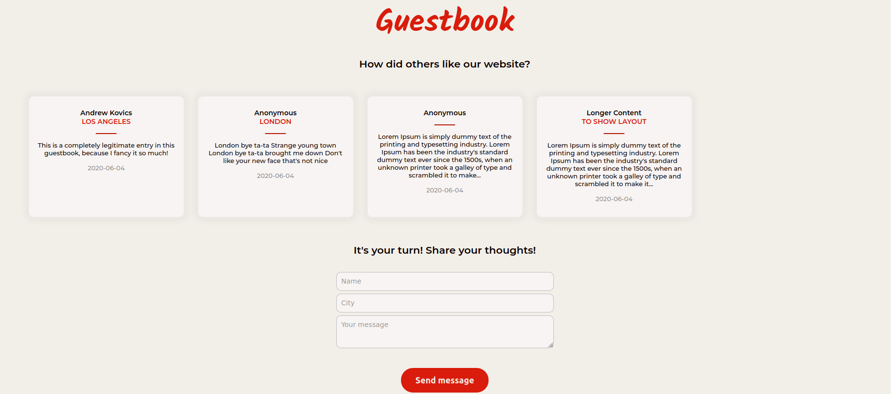

# Java exercise 8 - Guestbook with Java EE
Java EE exercise is my first attempt to join frontend and backend parts of the project. The aim was to take inputs from user, manipulate it with Java, save it in database and present all previous inputs on the simple website.

## Screenshots

The website has basic input validation and responsive layout.

## Technologies
* HTML5
* JSP
* HTTP servlets
* PostgreSQL
* CSS
* JavaScript
